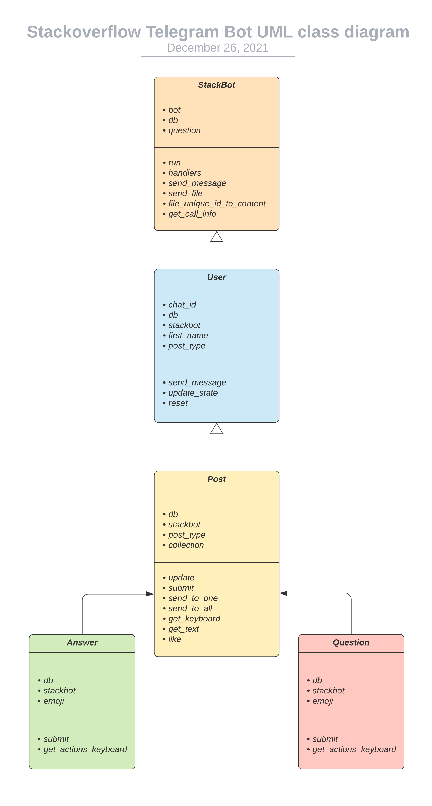
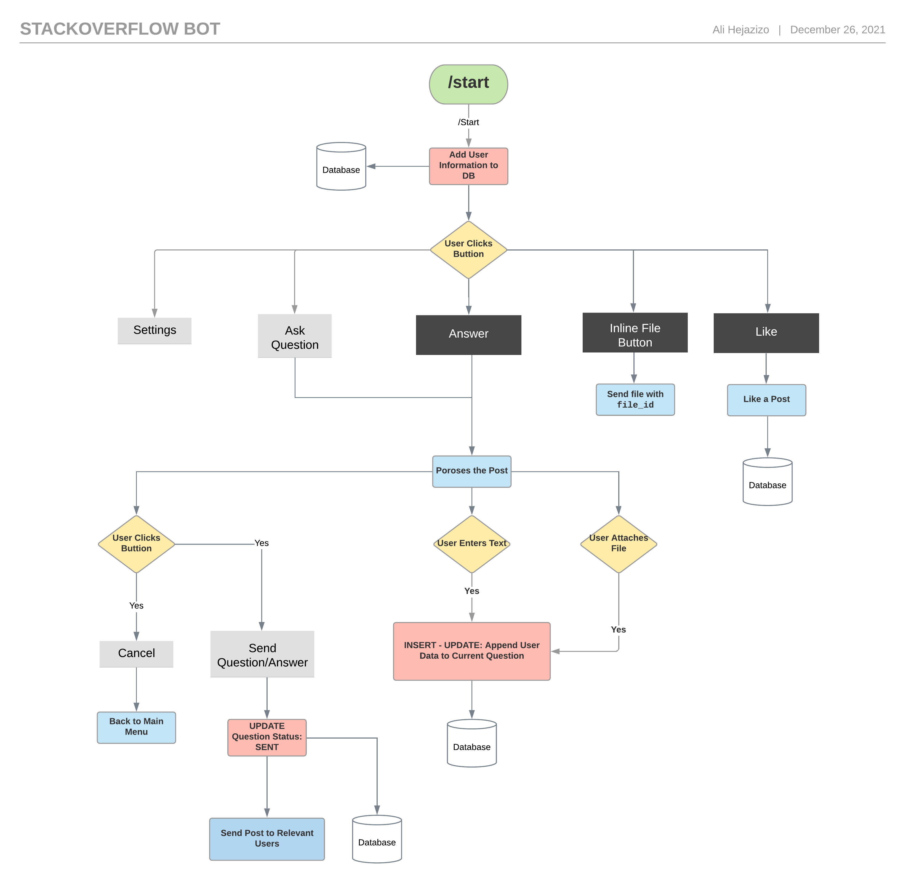

# Template for Telegram Bot

Template to create a telegram bot in python.

## How to Run
1. Set your telegram bot token as environment variable `TELEGRAM_BOT_TOKEN`:
```
export TELEGRAM_BOT_TOKEN=<your_telegram_bot_token>
```

2. Add `src` to `PYTHONPATH`:
```
export PYTHONPATH=${PWD}
```

3. Run:
```
python src/run.py
```

**Note:** You need to set up your mongodb database first in `src/db.py`.

## UML Diagram
See [UML Class Diagram](https://lucid.app/lucidchart/407122f0-176a-4d2e-bbe0-8f4f9929b823/edit?viewport_loc=-1156%2C-1499%2C4245%2C1512%2C0_0&invitationId=inv_5220253e-60fe-444f-ac44-f9daf499d31c) in Lucid Chart.



## User Journey
See [User Journey](https://lucid.app/lucidchart/597ca4b7-5bb7-4de4-bfd9-17fffe63dc5a/edit?viewport_loc=-1089%2C-312%2C6708%2C2389%2C0_0&invitationId=inv_2e288ea9-2812-4b66-8a44-3e14f1d9794f) in Lucid Chart.


